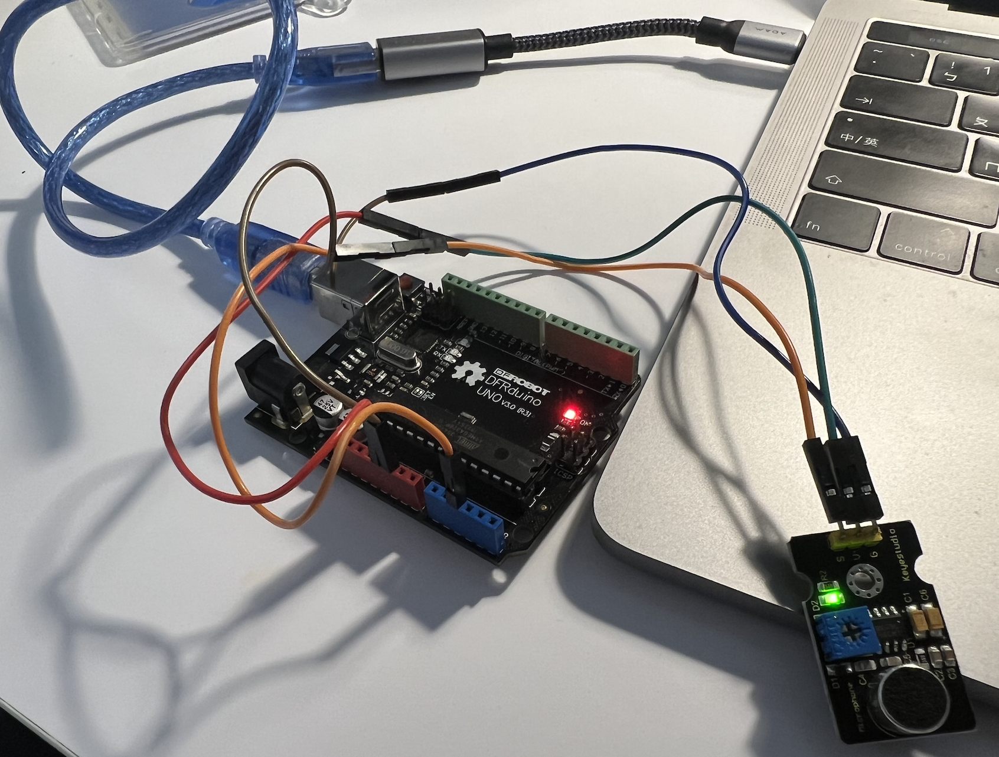
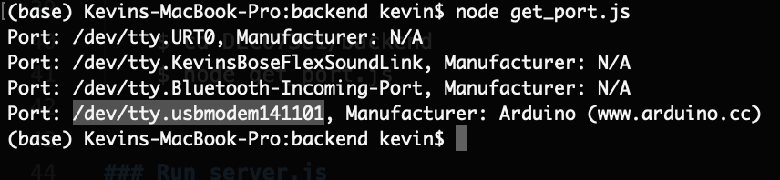
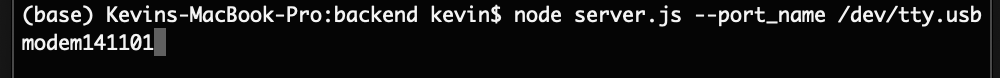

# Echoes of the Ocean

## Requirement
### Hardware
1. Arduino UNO, Lilypad
2. Sound and temperature sensors

### Software
1. ejs: "3.1.9" -- https://ejs.co/
2. express: "4.18.2", -- https://expressjs.com/
3. node-fetch: "7.0" -- https://www.npmjs.com/package/node-fetch
4. serialport: "12.0.0" -- https://www.npmjs.com/package/serialport
5. socket.io: "4.7.2" -- https://socket.io/
6. argparse: "3.9.0" -- https://www.npmjs.com/package/argparse

## Demo

## Getting Started

### Download our code

    $ git clone https://github.com/Kao1126/DECO7381.git

### Set up Arduino
Connect PC with Arduino.

### Install Node.js
We should install Node.js to run our project.

https://nodejs.org/en

### Get UNO Arduino port

To connect Arduino UNO with our computer, we have to get the UNO port name by running get_port.js.

    $ cd DECO7381/backend
    $ node get_port.js

### Run server.js
Build the server by running server.js and typing the port name obtained from previous step.

    $ node server.js --port_name [port name]

## Data Resource
