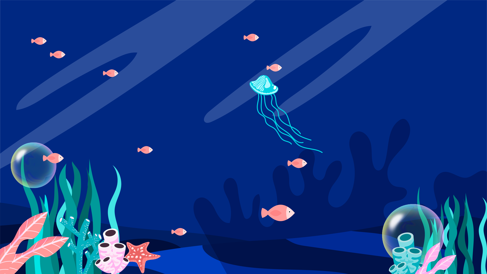
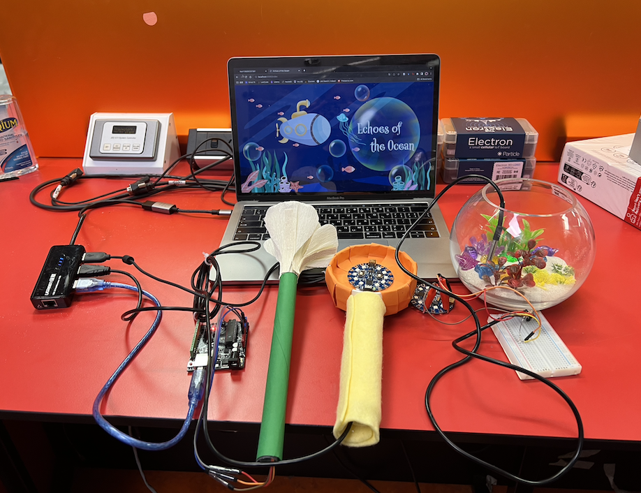

# Echoes of the Ocean
Our design "Echos of the Ocean".​​ It is a novel design that utilises IoT, database analytics, and compelling visual design to spotlight human impact on marine ecosystems. This interactive platform is targeted at Australian adolescents and combines data-driven insights with emotive narratives, focusing on the endangered Great Barrier Reef. Through sensor-driven simulations and immersive web experiences, users confront climate change's tangible repercussions. The project aims to invoke individuals' emotional impact to raise their awareness about ocean conservation. 

## Requirement
### Hardware
1. Arduino UNO, Lilypad
2. Sound and temperature sensors

### Software
1. ejs: "3.1.9" -- https://ejs.co/
2. express: "4.18.2", -- https://expressjs.com/
3. node-fetch: "7.0" -- https://www.npmjs.com/package/node-fetch
4. serialport: "12.0.0" -- https://www.npmjs.com/package/serialport
5. socket.io: "4.7.2" -- https://socket.io/
6. argparse: "3.9.0" -- https://www.npmjs.com/package/argparse
7. Arduino Temperature Control Library: “Latest” -- https://github.com/milesburton/Arduino-Temperature-Control-Library

## Demo

https://youtu.be/JmaaTGxBwvU?si=9_vdRanxIqHKHucf

## Getting Started

### Download our code

    $ git clone https://github.com/Kao1126/DECO7381.git

### Set up Arduino
Connect PC with Arduino.

### Install Node.js
We should install Node.js to run our project.

https://nodejs.org/en

### Get UNO Arduino port

To connect Arduino UNO with our computer, we have to get the UNO port name by running get_port.js.

    $ cd DECO7381/backend
    $ node get_port.js

### Run server.js
Build the server by running server.js and typing the port name obtained from previous step.

    $ node server.js --port_name [port name]

### Access to our project
Typing the following URL into your browser:

http://localhost:8080/index

## Data Resource
Coastal Data System – Near real time wave data
https://www.data.qld.gov.au/dataset/coastal-data-system-near-real-time-wave-data

SoE2020: Sea surface temperature
https://www.data.qld.gov.au/dataset/soe2020-sea-surface-temperature

Dynamics of hypersaline coastal waters in the Great Barrier Reef
https://research-repository.griffith.edu.au/bitstream/handle/10072/349523/AnduttaPUB2463.pdf;jsessionid=270BC842CEAD19C7FDF1220BDF697C61?sequence=1#:~:text=ABSTRACT-,The%20coastal%20waters%20of%20the%20Great%20Barrier%20Reef%20(GBR)%20are,the%20coast%20preventing%20rapid%20flushing.

Australia State of the Environment 
https://soe.dcceew.gov.au/marine/environment/marine-species#marine-mammals
Coral bleaching events | AIMS
https://www.aims.gov.au/research-topics/environmental-issues/coral-bleaching/coral-bleaching-events

Great Barrier Reef timeline: decades of damage and Australia’s fight to stop ‘in danger’ listing
https://www.theguardian.com/environment/2021/jun/22/great-barrier-reef-timeline-decades-of-damage-and-australias-fight-to-stop-in-danger-listing

Great Barrier Reef Marine Park Features
https://data.gov.au/dataset/ds-dga-51199513-98fa-46e6-b766-8e1e1c896869/details

AIMS eReefs Visualisation Portal 
https://ereefs.aims.gov.au/ereefs-aims

Australian Marine Parks
https://atlas.parksaustralia.gov.au/amps

eAtlas Data Catalogue - Spatial variability in bleaching severity on the Great Barrier Reef during 2016 & 2017
https://eatlas.org.au/geonetwork/srv/eng/catalog.search#/metadata/2805dd6c-1391-4df4-8137-e2a97f35a254

Climate change pressure on the Great Barrier Reef
https://www.stateoftheenvironment.des.qld.gov.au/biodiversity/estuarine-and-marine-ecosystems/climate-change-pressure-on-the-great-barrier-reef

Cumulative Impacts on the Great Barrier Reef
https://eatlas.org.au/gbr/nesp-twq-5-2-cumulative-impacts

Annual Summary Report of Coral Reef Condition 2022/23
https://www.aims.gov.au/monitoring-great-barrier-reef/gbr-condition-summary-2022-23

CSIRO - State of the Climate 2020: Oceans
https://www.csiro.au/en/research/environmental-impacts/climate-change/state-of-the-climate/previous/state-of-the-climate-2018/oceans

National Greenhouse Gas Inventory: Quarterly updates
https://www.dcceew.gov.au/climate-change/publications/national-greenhouse-gas-inventory-quarterly-updates

The coral reef crisis: The critical importance of <350 ppm CO2
https://www.sciencedirect.com/science/article/pii/S0025326X09003816#aep-section-id23

Australia CO2 Emissions
https://www.worldometers.info/co2-emissions/australia-co2-emissions/

Carbon Dioxide - Vital Signs Global Climate Change NASA
https://climate.nasa.gov/vital-signs/carbon-dioxide/

What is El Niño and how does it impact Australia? | Bureau of Meteorology
http://www.bom.gov.au/climate/updates/articles/a008-el-nino-and-australia.shtml

Climate Driver Update | Bureau of Meteorology
http://www.bom.gov.au/climate/enso/

Dogong dugon - Dugong
https://www.google.com/url?q=http://www.environment.gov.au/cgi-bin/sprat/public/publicspecies.pl?taxon_id%3D28&sa=D&source=docs&ust=1697433511605670&usg=AOvVaw1E8sLaR9tmRnfaYPen3bNq

Coral bleaching, the Great Barrier Reef and potential impacts on tourism
https://australiainstitute.org.au/wp-content/uploads/2020/12/Swann-Campbell-2016-Great-Barrier-Bleached-FINAL-w-cover.pdf

Clown Fish Facts - AZ Animals
https://a-z-animals.com/animals/clownfish/

How Many Dolphins Are Left in the World
https://247wallst.com/special-report/2019/07/25/how-many-dolphins-are-left-in-the-world/

Whales And Dolphins | gbrmpa 
https://www2.gbrmpa.gov.au/learn/animals/whales-and-dolphins 

Leaflet https://leafletjs.com/

P22 Muschamp Pro - Fonts 
https://fonts.adobe.com/fonts/p22-muschamp-pro#fonts-section

